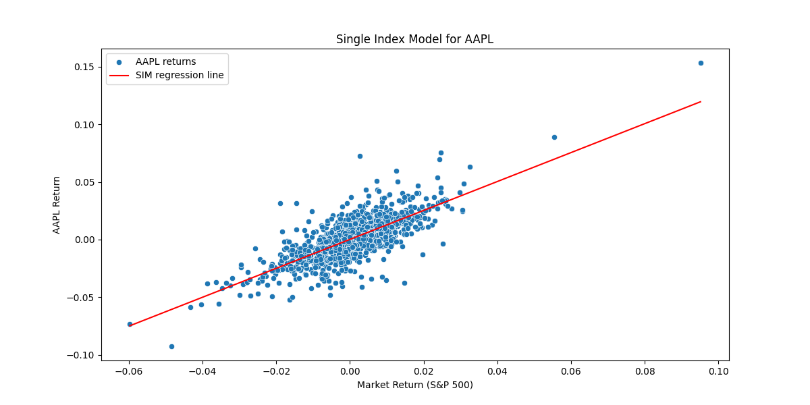

#### Structure of this repository
- Single-Index Model
- Value At Risk/ Conditional Value at Risk
- Modern Portfolio Theory
- Utility Maximization st. Risk-Aversion

```text
.
├── main.py
├── setup.py
├── LICENSE
├── config.yaml
├── requirements.txt
├── src
│   ├── __init__.py
│   └── models
│       ├── __init__.py
│       ├── max_utility.py
│       ├── mpt.py
│       ├── single_index_model.py
│       ├── utility.py
│       └── value_at_risk.py
├── scripts
│   ├── data_ingestion.py
│   ├── __init__.py
│   └── returns.py
├── notebooks
│   ├── _mpt.ipynb
│   ├── _risk.ipynb
│   ├── _single_index_model.ipynb
│   └── _utility.ipynb
├── tools
│   ├── config.py
│   ├── __init__.py
│   └── logger.py
├── images
│   ├── ef_assets_heatmap.png
│   └── sim
└── data
    ├── processed
    │   ├── etf_returns.csv
    │   ├── expected_returns.csv
    │   ├── returns.csv
    │   ├── sp500_returns.csv
    │   ├── stock_returns.csv
    │   └── vol.csv
    └── raw
        ├── all_prices.csv
        ├── etfs.csv
        ├── sp500_prices.csv
        └── stocks.csv

```

#### Note Books
[single-index_model](https://github.com/nickkats1/Portfolio/blob/main/notebooks/_single_index_model.ipynb)



[risk](https://github.com/nickkats1/Portfolio/blob/main/notebooks/_risk.ipynb)

[utility](https://github.com/nickkats1/Portfolio/blob/main/notebooks/_utility.ipynb)

[Modern Portfolio Theory](https://github.com/nickkats1/Portfolio/blob/main/notebooks/_mpt.ipynb)


